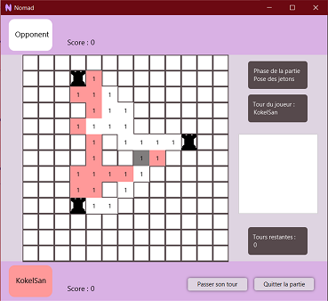

## The project 🚀

## What I learned 🌟

## Gallery 🖼️

||
:-------------------------:
|In-game UI|

24 students divided in 4 teams : data management, networking, main UI and in-game UI

Two players place up to 5 towers on the grid. Then, with pieces, they must connect the more towers they can

Role : in-game UI team’s designer

Application of the IT project management course : deadlines, versioning, audits, intra & inter teams meetings, quality etc…
